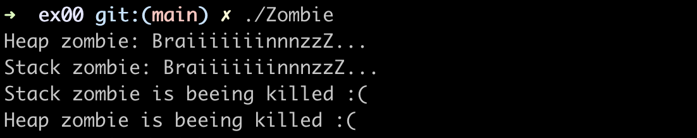
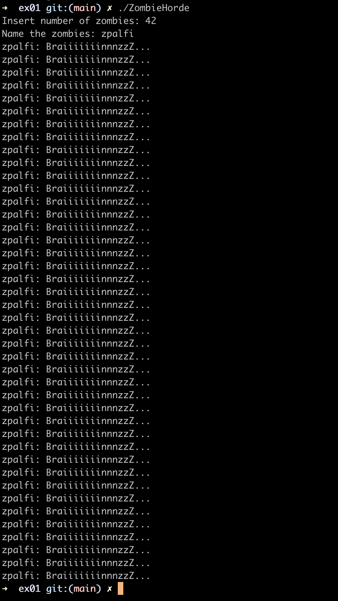
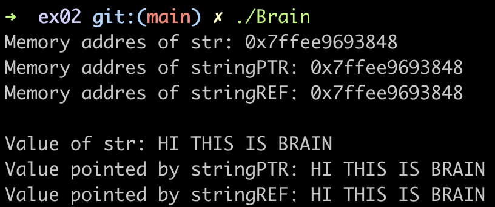
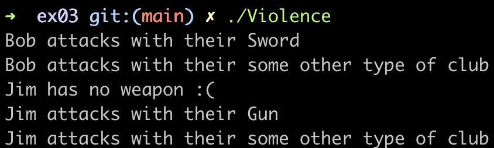

# CPP Module 01
CPP module 01, is a simple group of exercices in c++ to introduce us to the world of c++. In this module we will learn about memory allocation, pointers to members, references and switch statements.

## Exercise 00: BraiiiiiiinnnzzzZ

**Objective**: In this exercise we will have to implement a **zombie** class.

This zombie class will follow the next instrucctions:

- It has a string attribute **name**.
- It has a member function **void announce( void );** which is used for the zombies to announce themeselves as follows:

      NameOfTheZombie:BraiiiiiiinnnzzzZ...

- This class also has to have this following functions:
- - Zombie* newZombie( std::string name );
    It creates a zombie, name it, and return the zombie object.
- - void  randomChump( std::string name );
    It creates a zombie, name it, and the ombie announces itself.

The point of this exercices is to learn about allocation in the stack or the heap. 

**Files**: [`Makefile`](./ex00/Makefile), [`main.cpp`](./ex00/src/main.cpp), [`Zombie.cpp`](./ex00/src/Zombie.cpp), [`newZombie.cpp`](./ex00/src/newZombie.cpp), [`randomChump.cpp`](./ex00/src/randomChump.cpp), [`Zombie.hpp`](./ex00/includes/Zombie.hpp)

**Forbidden functions**: None

**Example of how it works**:

  

## Exercise 01: Moar brainz!

**Objective**: In this exercise we will have to implement a **horde of Zombies!**

To do this we will have tom implement the following function:

    Zombie* zombieHorde( int N, std::string name );
    
Where ***N*** is the number of Zombies objects we must allocate in a single allocation and initializes the zombies giving the name passed as a parameter. Th function must return a pointer to the first zombie.

The point of this exercise is to clean and check all the memory leaks.

**Files**: [`Makefile`](./ex01/Makefile), [`main.cpp`](./ex01/src/main.cpp), [`Zombie.cpp`](./ex01/src/Zombie.cpp), [`zombieHorde.cpp`](./ex01/src/zombieHorde.cpp), [`Zombie.hpp`](./ex01/includes/Zombie.hpp)

**Forbidden functions**: None

**Example of how it works**:

  

## Exercise 02: HI THIS IS BRAIN

**Objective**: The objective of this exercice is to learn the difference between references and addres pointers.

We must write a program that contains:

- A string initialized to "HI THIS IS BRAIN".
- stringPTR: A pointer to the string.
- stringREF: A reference to the string.

The program has to print:

- The memory address of the string variable.
- The memory address held by stringPTR.
- The memory address held by stringREF.
- The value of the string variable.
- The value pointed to by stringPTR.
- The value pointed to by stringREF.

**Files**: [`Makefile`](./ex02/Makefile), [`main.cpp`](./ex02/main.cpp)

**Forbidden functions**: None

**Example of how it works**:

  

## Exercise 03: Unnecessary violence

**Objective**: The objective of this exercice is to learn how to implement pointers and references and which one is best for some determinated situations.

First we need to implement a [**Weapon**](./ex03/include/Weapon.hpp) class. This class needs:

- A private string **type**.
- A **getType()** member function that returns a const reference to **type**.
- A **setType()** member function that sets **type** using the new one passed as a parameter.

Then we have to implement two more classes: [**HumanA**](./ex03/include/HumanA.hpp) and [**HumanB**](./ex03/include/HumanB.hpp). Those classes need:

- A **Weapon**.
- A private string **name**.
- A **attack()** member function that displays the following message:

      <name> attacks with their <weapon type>.
      
**HumanA** and **HumanB** are almost the same except for these details:

- **HumanA** takes the **Weapon** in its constructor, **HumanB** doesn't.
- **HumanB** may **not always** have a **Weapon**, **HumanA** will **always** have one.

**Files**: [`Makefile`](./ex03/Makefile), [`main.cpp`](./ex03/src/main.cpp), [`Weapon.cpp`](./ex03/src/Weapon.cpp), [`HumanA.cpp`](./ex03/src/HumanA.cpp), [`HumanB.cpp`](./ex03/src/HumanB.cpp), [`Weapon.hpp`](./ex03/includes/Weapon.hpp), [`HumanA.hpp`](./ex03/includes/HumanA.hpp), [`HumanB.hpp`](./ex03/includes/HumanB.hpp)

**Forbidden functions**: None

**Example of how it works**:

  

## Exercise 04: Sed is for losers

**Objective**: This program have to take three parameters in the following order: a **filename** and two strings, **s1** and **s2**. When executed, the program must open the file **filename** and copy its contents replacing each ocurrence of **s1** by **s2**.

**Files**: [`Makefile`](./ex04/Makefile), [`main.cpp`](./ex04/src/main.cpp)

**Forbidden functions**: `std::string::replace`

## Exercise 05: Harl 2.0

**Objective**: The objective of this exercive is to create a program containing a class **Harl**. This class will have the following private member functions:

- void debug( void );
- void info( void );
- void warning( void );
- void error( void );

This functions represents the differents levels of messsges that Harl have. Harl also have the public function member:

- void complain( std::string level );

Which will call the correct function depending on the level passed as parameter.
The real objective of this exercice is to learn how to use the pointer to member functions, to avoid using a lot of if/else.

**Files**:

**Forbidden functions**:

## Exercise 06: Harl filter

**Objective**:

**Files**:

**Forbidden functions**:
